# Лаб2
## Задание: 
Реализовать программу согласно описанию. Можно использовать языки 
C++ или Python и любые библиотеки, при этом необходимо чтобы вся
задача не решалась только с помощью одной встроенной функции 
(например, lib.detect_template(image, template).
Сравнить качество работы двух вариантов реализации по точности 
детектирования.

Необходимо реализовать два примитивных детектора объектов на 
изображении, работающих с помощью поиска эталона на входном 
изображении. 
1. Прямой поиск одного изображения на другом (template matching)
2. Поиск ключевых точек эталона на входном изображении (например, с 
помощью SIFT, ORB..)

## Теория: 
Функция match_template проверяет для каждого пикселя исходного изображения насколько окрестности этого пикселя совпадают с шаблоном.

ORB представляет собой сочетание детектора ключевых точек FAST и дескриптора BRIEF со многими модификациями для повышения производительности. Сначала он использует FAST, чтобы найти ключевые точки, а затем применяет угловую меру Харриса, чтобы найти топ N точек среди них. 

Как работает FAST: 
1. Выберает пиксель p на изображении, который должен быть идентифицирован как точка интереса. Пусть его интенсивность будет Ip.
2. Выберает соответствующее пороговое значение t.
3. Рассматривает круг из 16 пикселей вокруг тестируемого пикселя. Важно, что круг состоит не из 16 пикселей, а его "длина" равна 16.
4. Теперь пиксель p является углом, если существует множество n смежных пикселей в круге (из 16 пикселей), которые ярче, чем Ip+t, или все темнее, чем Ip-t. Обычно n=12.

Как работает BRIEF:
Он берет патч сглаженного изображения и выбирает набор nd (x,y) пар местоположений уникальным образом. Затем для этих пар местоположений выполняются некоторые сравнения интенсивности пикселей. Например, пусть первые пары местоположений будут p и q. Если I(р)<I(q), то его результат равен 1, иначе он равен 0. Это применяется ко всем nd парам местоположений, чтобы получить nd-размерную битовую строку.

Для дескрипторов ORB использует дескрипторы BRIEF. Но BRIEF плохо работает с вращением. Итак, что делает ORB, так это «направляет» BRIEF в соответствии с ориентацией ключевых точек. Для любого набора n бинарных тестов на месте (xi,уi) определяется матрица C(2×n), которая содержит координаты этих пикселей. Затем, используя ориентацию патча,θ, находится его матрица вращения и поворачивает С на θ, получая повернутую Сθ.
ORB дискретизирует угол с шагом 2π/30 (12 градусов) и строит справочную таблицу предварительно вычисленных шаблонов BRIEF. Пока ориентация ключевой точки θ согласуется между представлениями, правильный набор точек Сθ будет использоваться для вычисления его дескриптора.

## Реализация: 
Программа считывает оригинальное изображение и изображения "template", которые мы будем искать на исходном изображении. 
Реализация с функцией match_template принимает на вход два изображения и отрисовывает прямоугольник на исходном изображении в том месте, где произошло наибольшее совпадение с изображением template.

Реализация с ORB, после запуска методов ORB возвращает массив дескрипторов ключевых точек для изображения. Это делается как для исходного, так и для template изображения. Затем с помощью функции BF.Matcher.match, которая принимает на вход массивы дескрипторов обоих изображений, получаем список из структур, содержащих разности между дескрипторами, и берем n (задаем сами) дескрипторов, находящихся ближе всего. Это и есть точки на исходном и template изображении, которые "похожи" друг надруга сильнее всего. 

## Результаты работы программы:
Возьмем три набора изображений: 
- Бурдж-Халифа, одно из 5 template изоражений является вырезанным с оригинальной картинки, остальные - фотографии под другим углом объектов, которые есть на фото
- Стол с ноутбуком и прочими вещами, 2 изображения вырезаны, остальные под другим углом
- Тетрадки, мышка и наклейка, 1 изображение вырезано, остальные под другим углом
### С помощью функции match_template
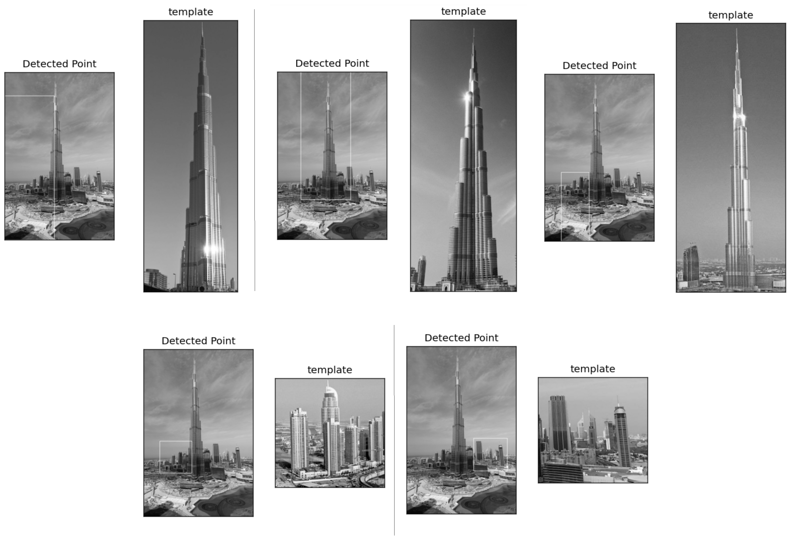

Рисунок 1 – Бурдж-Халифа match_template

Как можно видеть только для одного изображения границы определились неправильно. Это изображение башни под другим углом. Остальные изображения снятые под другим углом нашлись верно.
                            
                            
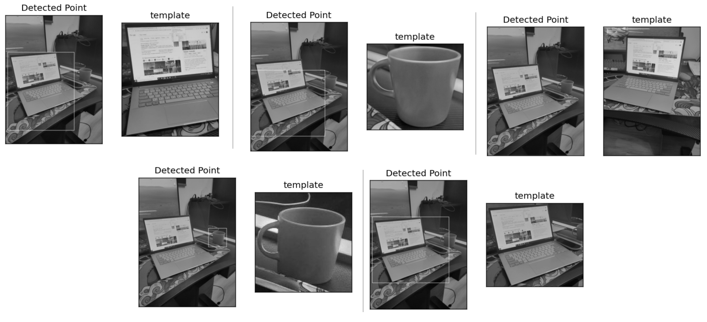

Рисунок 2 – Стол match_template

Для одного из изображений границы определились неправильно. Для одного не определились вообще. Оба из них снятые под другим углом объекты.
                            

Рисунок 3 – Тетрадки match_template                            

Только для одного изображения определились границы правильно, это изображение вырезано из оригинала. Для всех снятынх под другим углом объектов границы не определились вообще.

### С помощью функции ORB
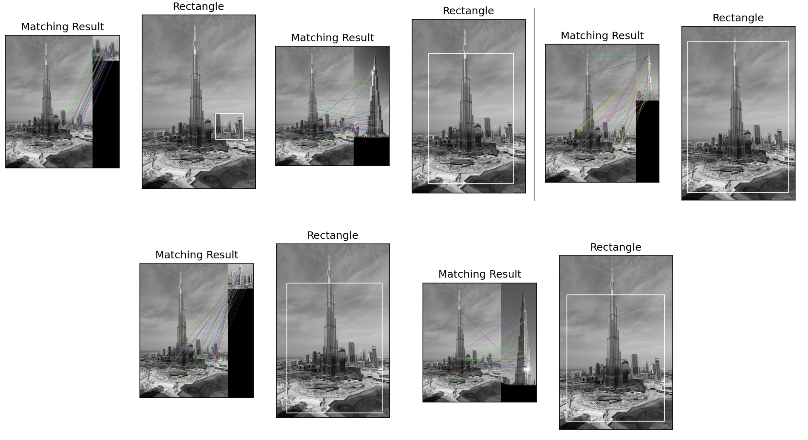

Рисунок 4 – Бурдж-Халифа ORB

Как можно видеть в целом все границы определились праавильно, но есть небольише неточности для объектов снятых под другим углом.
                            
                            
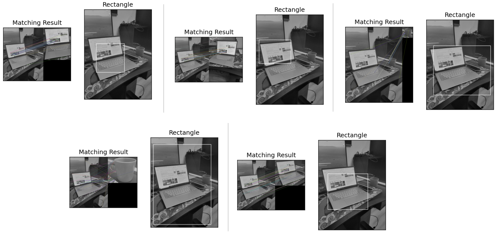

Рисунок 5 – Стол ORB

На обоих изображениях с кружкой границы нашлись неправильно, для остальных - достаточно точно.
                            
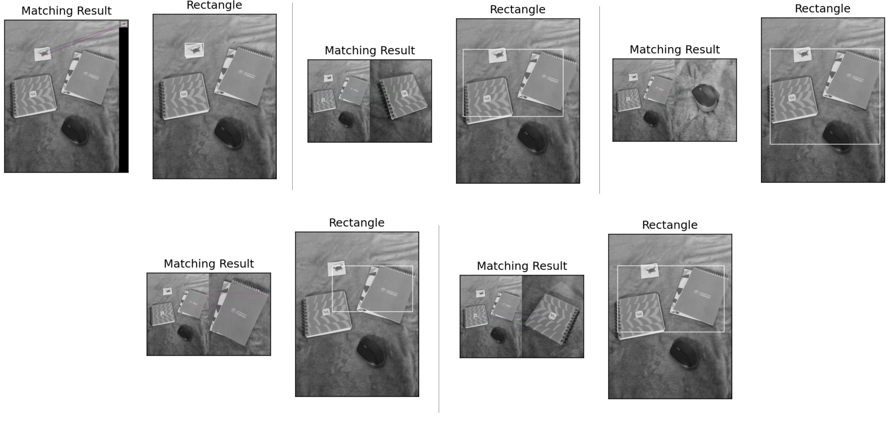

Рисунок 6 – Тетрадки ORB                           

Для двух изображений границы определились верно, еще для двух - шире, чем нужно. Для одного определены неправильно.

## Выводы: 
В результате работы были реализованы два варианта нахождения части изображения на исходном: с помощью функции match_template и с помощью ORB. Как показали результаты работы программы, видно, что вариант с ORB работает достаточно лучше, он реже грубо ошибается, поэтому намного лучше подходит для варинтов, когда изображение, которое необходимо найти на исходном не выреазно оттуда, а сфотографировано под другим углом

# Лаб1
## Задание: 
1. Реализовать программу согласно варианту задания. Базовый алгоритм, используемый в программе, необходимо реализовать в 3 вариантах: с использованием встроенных функций какой-либо библиотеки (OpenCV, PIL и др.) и нативно на Python + |с использованием Numba или C++|. 
2. Сравнить быстродействие реализованных вариантов.
Примечание. Программа работает с видео. На вход должен поступать видеопоток с устройства (камеры) или видео должно читаться из файла. Каждый алгоритм нужно реализовать в 3 вариантах: с использованием сторонних библиотек на Python, с помощью примитивных операций и циклов на Python (можно использовать NumPy массивы) и с помощью компилируемого кода (на C++ либо с использованием, например, Numba на Python). Если указано, что выходное изображение переключается между черно-белым и после обработки, это значит, что на вход обработки подается черно-белое изображение.
## Вариант задания:
Бинаризация с адаптивным порогом. На вход поступает изображение, программа отрисовывает окно, в которое выводится либо исходное изображение после преобразования в черно-белое, либо после бинаризации (переключение по нажатию клавиши).
## Теория: 
Суть бинаризации заключается в определении порога яркости оттенков серого для картинки. Если значение яркости пикселя выше порогового, то пиксель заменяется на черный (255), ниже – на белый (0). 
Существует бинаризация с простым порогом и адаптивным. В данной лабораторной необходимо реализовать бинаризацию с адаптивным порогом методом среднего. Для этого все изображение разбивается на блоки размером blocksize* blocksize, для которого считается среднее значение яркости пикселя, затем из него вычитается константа, единая для каждого из блоков. Также можно домножать получившееся среднее для каждого блока на общую вторую константу const2.

## Реализация: 
Программа считывает видео из файла с помощью функции OpenCV. Затем идет цикл по кадрам, в котором для каждого кадра происходит переход в оттенки серого, а затем происходит бинаризация изображения. Далее этот кадр выводится на экран, а также сохраняется с помощью функции VideoWriter, которая принимает на вход кадры и сохраняет их в видео.

## Результаты работы программы:
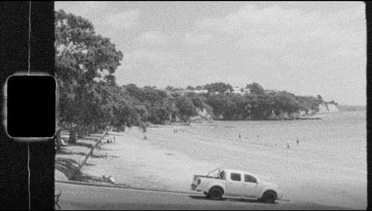

Рисунок 1 – Исходное изображение

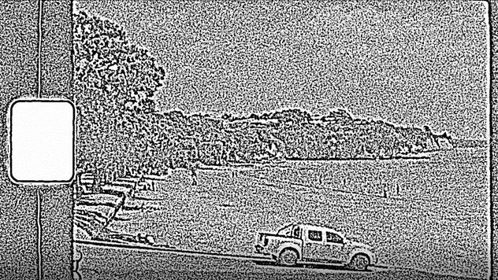

Рисунок 2 –Изображение обработанное с OpenCV

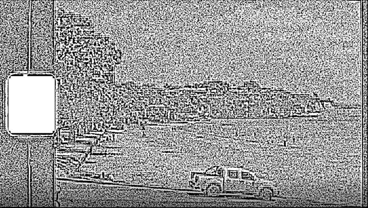

Рисунок 3 –Изображение обработанное с помощью своей функции

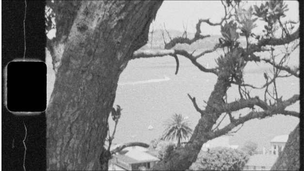

Рисунок 4 – Исходное изображение 2

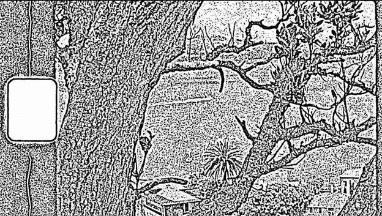

Рисунок 5 – Изображение 2 обработанное с OpenCV

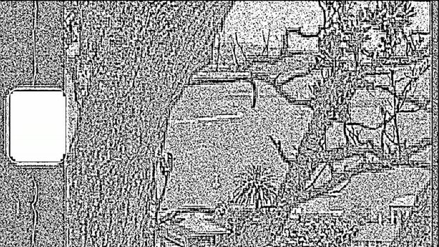

Рисунок 6 –Изображение 2 обработанное с помощью своей функции

Теперь попробуем вычесть обработанные изображения разными методами друг из друга. 
Изображения при обработке с циклами и с циклами, но скомпилированном кодом совпадают полностью.
Разница между методами с циклами с функцией OpenCV - не все пиксели совпали, а только 75%.

## Выводы:
В результате работы была реализована бинаризация видео 3 вариантами: с использованием сторонних библиотек на Python, с помощью примитивных операций и циклов на Python и с помощью компилируемого кода с использованием Numba.
Время выполнения бинаризации одного и того же видео:

|            |С использованием OpenCV|Нативно на python|Компилируемый код|
:------------|-----------------------|-----------------|-----------------|
|Время работы| 7.7 сек | 1440 сек | 9.65 сек 

Скомпилированный код работает немного медленнее, чем функция OpenCV, это связанно с тем, что в функции грамотно распараллелены вычисления.
По картинкам видно, что они немного отличаются друг от друга.
При этом обработанные картинки обоими вариантами выглядят «адекватно», но при использовании готового решения не так заметны квадратные области, для каждой из которых рассчитывается свой порог. Это, скорее всего, связанно с тем, что в функции OpenCV происходит какая-то последующая обработка изображения.
